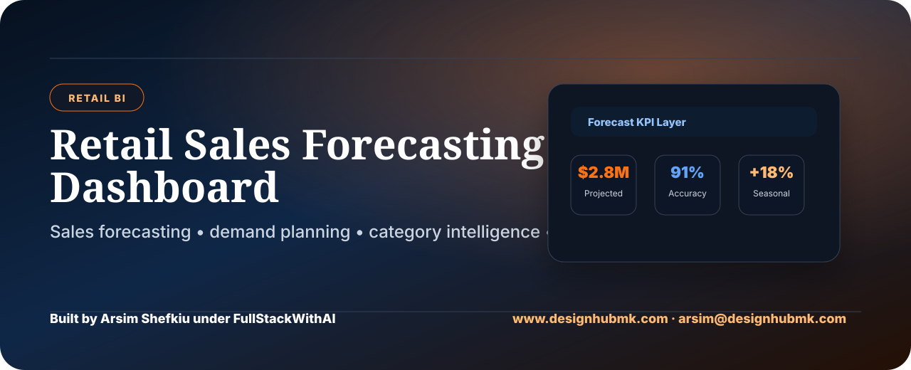

# Retail Sales Forecasting Dashboard

> Retail BI dashboard for sales forecasting, demand planning, category performance, seasonal trends, and executive growth visibility.

Built by **Arsim Shefkiu** under **FullStackWithAI**.

[www.designhubmk.com](https://www.designhubmk.com) · arsim@designhubmk.com · [GitHub: fullstackwithai](https://github.com/fullstackwithai)

---

## Retail Forecasting Theme

> **Sales trends to forecast clarity. Product demand to smarter inventory decisions.**

This repository is presented as a premium retail analytics dashboard concept. It focuses on sales forecasting, category performance, seasonality, store-level trends, and executive decision support.

| Theme Layer | Direction |
|---|---|
| **Design Identity** | Blue, orange, and dark executive retail-growth palette |
| **Product Feel** | Retail command center / demand forecasting dashboard |
| **Audience** | Retail managers, analysts, operations teams, BI hiring managers |
| **Core Message** | Sales data + forecast logic + category intelligence + inventory clarity |

---

## Forecast KPI Layer

| KPI | Purpose |
|---|---|
| **Projected Revenue** | Estimates upcoming sales performance |
| **Forecast Accuracy** | Measures prediction quality |
| **Top Category** | Identifies high-performing product groups |
| **Seasonal Lift** | Highlights demand spikes by period |
| **Inventory Risk** | Flags potential overstock or stockout exposure |

---

## Business Questions

| Question | Why It Matters |
|---|---|
| **Which categories are forecasted to grow?** | Helps prioritize buying and marketing decisions |
| **Where is demand likely to drop?** | Reduces inventory waste and missed planning |
| **Which stores need more attention?** | Supports store-level performance management |
| **How reliable is the forecast?** | Helps leadership trust the dashboard outputs |

---

## What This Project Demonstrates

| Capability | Evidence in This Repo |
|---|---|
| **Forecasting Thinking** | Sales projection, seasonality, and demand planning concepts |
| **Retail BI** | Category, store, and product performance logic |
| **Dashboard Strategy** | KPI-first reporting for retail leadership |
| **Data Storytelling** | Converts trend movement into planning recommendations |
| **Portfolio Positioning** | A recruiter-ready DA/BI project with commercial retail value |

---

## Suggested Project Architecture

```text
retail-sales-forecasting-dashboard/
├── assets/
│   └── readme-hero.svg
├── data/
│   └── retail-sales-sample.csv
├── sql/
│   └── forecasting-analysis.sql
├── dashboard/
│   ├── index.html
│   ├── styles.css
│   └── app.js
├── insights/
│   └── executive-summary.md
└── README.md
```

---

## Creator & Brand

### Built by **Arsim Shefkiu** under **FullStackWithAI**

> **Retail BI theme focused on forecasting, demand planning, category intelligence, and executive growth visibility.**

| Creator Focus | Brand Positioning |
|---|---|
| I build analytics dashboards that turn retail activity into forecast-ready business insight. | **FullStackWithAI** represents premium portfolio work built around practical data problems, polished presentation, and AI-assisted execution. |

**Theme:** Retail BI · Sales Forecasting · Demand Planning · Category Intelligence

[www.designhubmk.com](https://www.designhubmk.com) · arsim@designhubmk.com · [GitHub: fullstackwithai](https://github.com/fullstackwithai)
